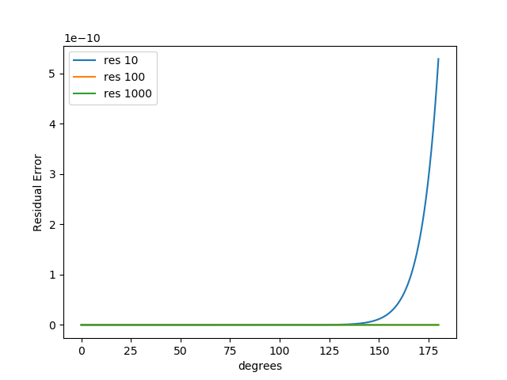
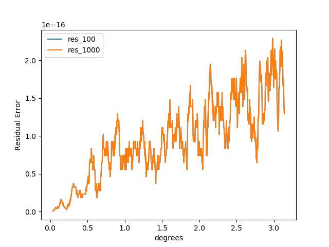

# sin

sin(x) (0 \leq x < \pi)を計算するプログラム.

- 使用言語: Python

# TODO
- [x] sin関数の実装
- [x] 誤差範囲の確認
- [x] テスト（関係性を満たす）
- [x] 競プロ風インターフェース
- [ ] ゴールデンアウトプット

# 誤差の確認
**numpy.sin(x)** のと比較（オーダーごと）
```python
res = abs(numpy.sin(x) - sin(x, order))
```
で算出

### オーダー（10, 100, 1000）


### オーダー（100, 1000）

